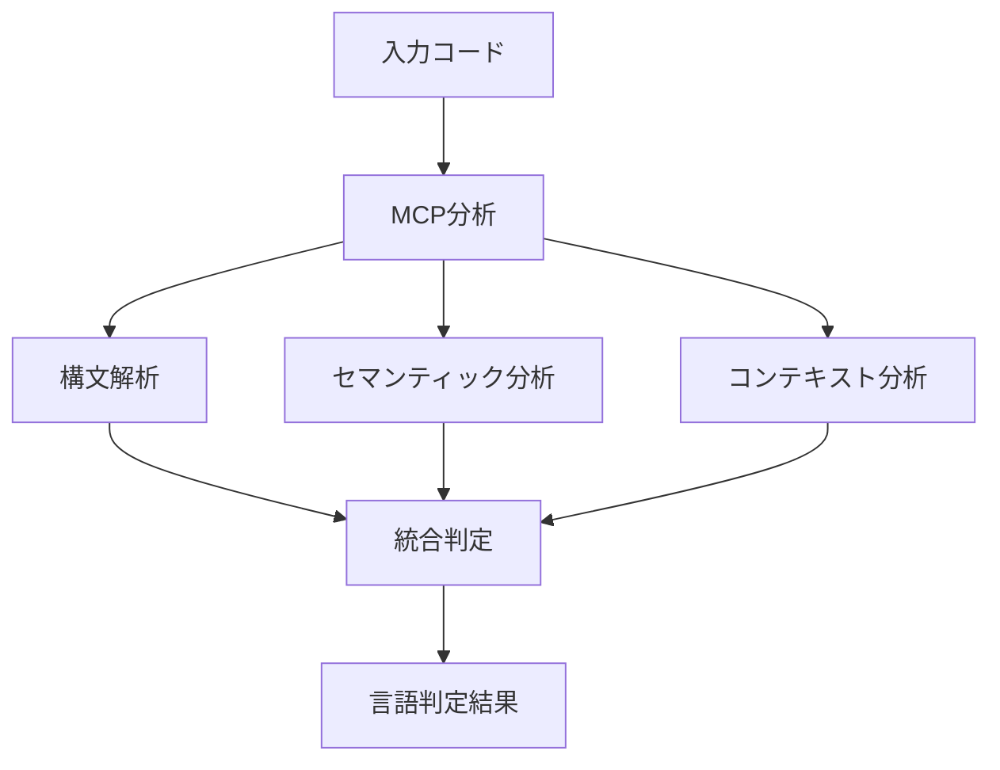
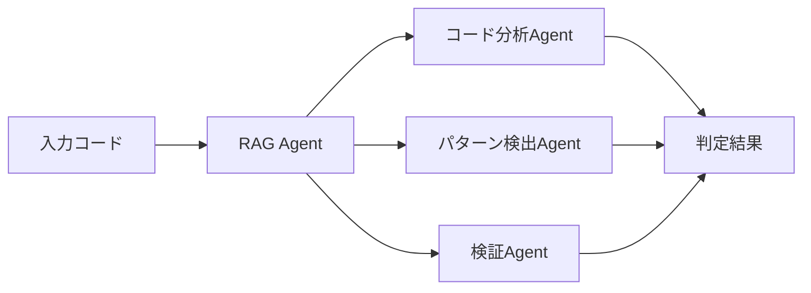
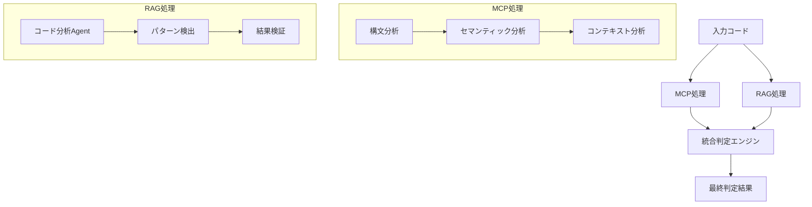
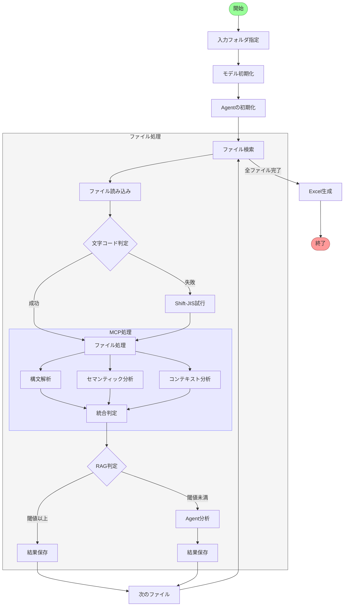
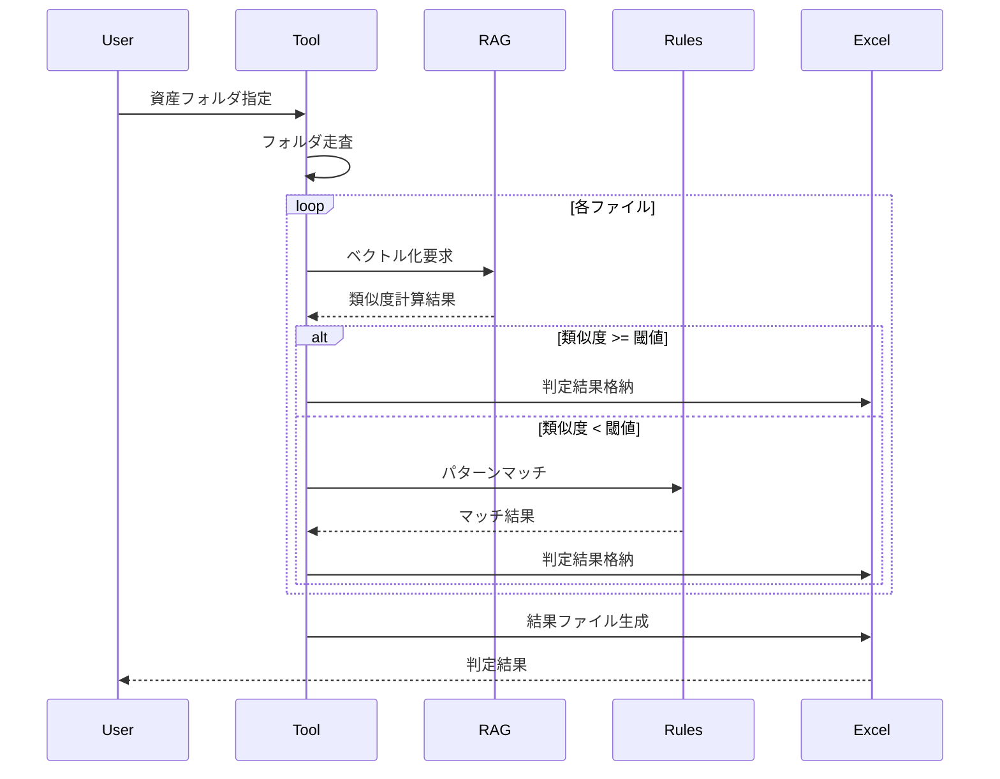
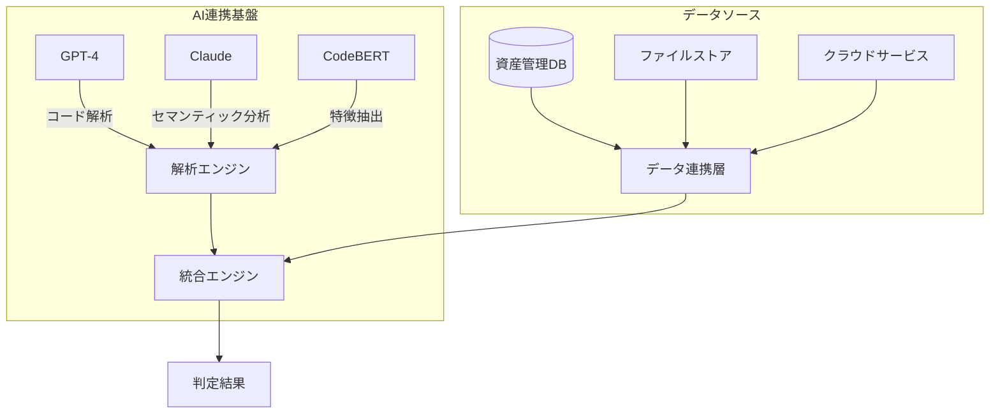
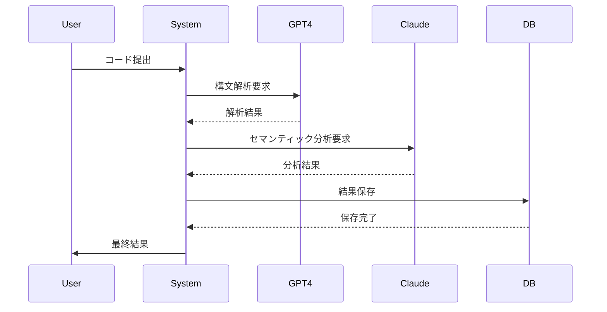

# 資産開発言語判定ツール仕様書

## 1. 概要

### 1.1 目的
- テキストベースの資産ファイルを解析し、開発言語を自動判定するツール
- RAGベースの機械学習による高精度な言語判定
- マルチモーダル分析による判定精度の向上
- 複数のAIモデルによる総合的な言語判定
- クラウドサービスとの連携による分散処理対応
- リアルタイム/バッチ処理両対応の柔軟な実行
- 結果をExcel形式で出力し、資産管理を効率化

### 1.2 背景
- 大規模システムにおける資産管理の効率化
- 手動での言語判定作業の自動化ニーズ
- 資産棚卸し作業の効率化

### 1.3 技術用語解説

| 技術分野 | 用語 | 説明 |
|---------|------|------|
| 機械学習基盤 | RAG | Retrieval Augmented Generation - 情報検索強化型生成モデル。既存のコードベースから類似パターンを検索・活用 |
| | CodeBERT | コード専用の事前学習済み言語モデル。プログラミング言語の特徴を理解・分析可能 |
| | GPT-4 | OpenAIの大規模言語モデル。コードの高度な意味理解と分析が可能 |
| | Claude | Anthropicの言語モデル。セマンティック分析に特化 |
| 高度化手法 | MCP | Multi-Context Processing - マルチモーダルなコンテキスト処理。構文、セマンティック、依存関係を統合的に分析 |
| | Agentic RAG | 複数のエージェントによる協調的なRAG処理。コード分析、パターン検出、検証を役割分担して実行 |
| | Agent | 特定の役割を持つ自律的な処理単位。専門性を持って特定タスクを実行 |
| データ連携 | Azure Storage | Microsoftのクラウドストレージサービス。大規模コードベースの保存・管理に使用 |
| | AWS S3 | Amazonのクラウドストレージサービス。分散処理と大容量データ管理に活用 |
| | PostgreSQL | リレーショナルデータベース。資産管理情報の永続化に使用 |
| | MongoDB | NoSQLデータベース。言語パターンやベクトルデータの格納に活用 |
| 判定技術 | 類似度閾値 | 言語判定の確度を示す0.0-1.0の値。高いほど判定の信頼性が向上 |
| | 構文解析 | プログラムの文法構造を解析し、言語特徴を抽出する処理 |
| | セマンティック分析 | コードの意味的な特徴を理解し、言語固有のパターンを検出 |
| テキスト処理 | chardet | 文字コード自動判定ライブラリ。多様な文字エンコーディングに対応 |
| | 有効ステップ数 | コメント行を除いた実コード行数。実際の処理を行うコードの量を示す |
| システム | GPU支援 | CUDA対応GPUによる並列処理。大規模コードベースの高速分析に活用 |
| | バッチ処理 | 複数ファイルの一括処理機能。大量資産の効率的な分析を実現 |
| | フォールバック | エラー発生時の代替処理。複数AIモデルの段階的な利用により安定性を確保 |
| セキュリティ | APIキー認証 | 外部AIサービスへのアクセス制御。トークンベースの認証を実装 |
| | SSL/TLS | データベース接続の暗号化。セキュアな通信を確保 |
| | 監査ログ | システムの動作記録。セキュリティ監視とトレーサビリティを実現 |

### 1.4 高度化手法：MCP/Agentic RAG

#### 1.4.1 MCPによる判定強化


1. マルチモーダル分析
   - 構文構造の解析
   - コメントスタイルの分析
   - インデントパターンの認識

2. コンテキスト理解
   - ファイル間の依存関係分析
   - システム構成との整合性確認
   - 使用ライブラリの関連性チェック

#### 1.4.2 Agentic RAGによる改善


Agent構成と役割:
1. コード分析Agent
   - 言語特徴の抽出
   - コーディングスタイルの認識
   - 依存関係の分析

2. パターン検出Agent
   - 言語固有パターンの検出
   - ライブラリ使用パターンの認識
   - フレームワーク特性の判定

3. 検証Agent
   - 判定結果の整合性確認
   - 信頼度スコアの計算
   - エッジケースの検出

#### 1.4.3 統合アーキテクチャ


#### 1.4.4 改善効果
1. 判定精度の向上
   - 誤判定率: 現行5%→改善後1%未満
   - 判定不能率: 現行10%→改善後3%未満

2. 処理性能の向上
   - 並列処理による高速化
   - バッチ処理の最適化
   - メモリ使用効率の改善

3. 新規言語への対応
   - 自動学習による言語パターン獲得
   - 未知の言語特徴の検出能力向上
   - 方言やカスタム言語への適応
### 1.5 処理フロー詳細

#### 1.5.1 プロセスフロー


#### 1.5.2 シーケンス図



## 2. 識別対象

### 2.1 入力ファイル
- 指定フォルダ配下の全テキストファイル
- サブディレクトリを含む再帰的な検索
- 文字コード: UTF-8, Shift-JIS対応

#### 2.1.1 入力ファイル例
##### JCLファイル例 (sample.jcl)
```jcl
//SAMPLE   JOB (ACCT),'JOB NAME',CLASS=A,
//             MSGCLASS=X,MSGLEVEL=(1,1)
//STEP1    EXEC PGM=IEBGENER
//SYSPRINT DD  SYSOUT=
//SYSIN    DD  DUMMY
//SYSUT1   DD  DSN=INPUT.FILE,DISP=SHR
//SYSUT2   DD  DSN=OUTPUT.FILE,
//             DISP=(NEW,CATLG,DELETE),
//             SPACE=(CYL,(10,5))
```

##### COBOLファイル例 (program.cbl)
```cobol
       IDENTIFICATION DIVISION.
       PROGRAM-ID. SAMPLE-PROG.
       ENVIRONMENT DIVISION.
       DATA DIVISION.
       WORKING-STORAGE SECTION.
       01  WS-COUNTER  PIC 9(4) VALUE ZERO.
       PROCEDURE DIVISION.
           DISPLAY "HELLO WORLD"
           STOP RUN.
```

##### アセンブラファイル例 (macro.asm)
```assembly
         MACRO
         SAMPLE &PARM
         GBLC  &GLOBAL
&GLOBAL  SETC  '&PARM'
         MEND
PROGRAM  CSECT
         USING *,15
         WTO   'HELLO'
         BR    14
         END
```

### 2.2 識別対象言語
```python
LANGUAGES = {
    'JCL': ['//'],
    'COBOL': ['IDENTIFICATION', 'PROCEDURE'],
    'ASM': ['MACRO', 'CSECT'],
    'PROC': ['PROC', 'PEND'],
    'COPY': ['COPY', 'INCLUDE'],
    'FORTRAN': ['PROGRAM', 'SUBROUTINE'],
    'Python': ['def ', 'class ', 'import ', '#'],
    'Java': ['public class', 'private', 'package'],
    'JavaScript': ['function', 'const', 'let', 'var'],
    'C++': ['#include', 'namespace', 'template'],
    'C#': ['using ', 'namespace', 'public class'],
    'SQL': ['SELECT', 'INSERT', 'CREATE TABLE'],
    'PHP': ['<?php', 'function', 'class'],
    'Ruby': ['def ', 'class ', 'require'],
    'Go': ['package ', 'func ', 'import'],
    'Rust': ['fn ', 'pub ', 'use '],
    'Swift': ['class', 'struct', 'import'],
    'TypeScript': ['interface', 'type', 'export'],
    'Shell': ['#!/bin', 'echo', 'export'],
    'Perl': ['use ', 'sub ', '#!/usr/bin/perl'],
    'R': ['library(', 'function(', '<-'],
    'REXX': ['/* REXX */', 'SAY', 'EXIT'],
    'Pascal': ['program', 'begin', 'end.'],
    'Basic': ['DIM ', 'SUB ', 'FUNCTION'],
    'PL/I': ['DCL', 'PROCEDURE', 'END;'],
    'Ada': ['package', 'procedure', 'begin'],
    'Lisp': ['defun', 'setq', '(let'],
    'XDM_MAP': ['DMAP', 'DSECT', 'DFLD'],
    'ADM_MAP': ['MAP', 'MEND', 'FIELD'],
    'SYSIN': ['/*', '//', 'SYSIN'],
    'OVERLAY': ['OVERLAY', 'POSITION', 'FIELD'],
    'ADAMINT': ['ADAINT', 'RECORD', 'FIELD'],
    'FOG': ['FOG', 'FORMAT', 'GROUP'],
    'VSAM': ['DEFINE', 'CLUSTER', 'INDEX'],
    'NATURAL': ['DEFINE DATA', 'END-DEFINE', 'WRITE'],
    'IDEAL': ['PROCEDURE', 'TRANSMIT', 'ENDPROC'],
    'EASYTRIEVE': ['PARM', 'FILE', 'SORT'],
    'SORT': ['SORT FIELDS', 'INCLUDE COND', 'OUTREC'],
    'Control-M': ['IF JOBRC', 'DOCOND', 'ENDDOCOND'],
    'UCM': ['DEFUCM', 'ENDDEF', 'INCLUDE'],
    'ADS/O': ['ACTIVITY', 'PROCESS', 'ENDACTIVITY'],
    'CICS': ['EXEC CICS', 'DFHCOMMAREA', 'SEND MAP'],
    'IMS': ['PCB TYPE=', 'SEGM', 'DBDGEN'],
    'CA-7': ['ADJUST', 'RESOURCE', 'REQUIRES'],
    'CA-1': ['TMSGRW', 'TMSCTRL', 'TMSRPT'],
    'DYL280': ['DYL280', 'REPORT', 'SEQUENCE'],
    'RPG': ['FCALC', 'FTIME', 'RLABL'],
    'PL/M': ['DECLARE', 'PROCEDURE', 'END'],
    'ALC': ['BALR', 'USING', 'DROP'],
    'TPF': ['LEVTA', 'SERRC', 'SYSRA'],
    'ACF2': ['ACF', 'SET', 'CHANGE'],
    'NDM': ['PROCESS', 'SUBMIT', 'NOTIFY'],
    'QMF': ['FORM', 'PROC', 'REPORT'],
    'SMP/E': ['RECEIVE', 'APPLY', 'ACCEPT'],
    'DMS': ['FILEDEF', 'GLOBAL', 'LOADLIB']
}
```

### 2.3 識別方法
#### 2.3.1 RAGベースの言語判定
- 事前学習済みモデル: CodeBERT
- ファイルコンテンツのベクトル化
- 言語特徴データベースとの類似度計算
- マルチモーダル分析による精度向上

#### 2.3.2 ルールベースのバックアップ判定
```python
LANGUAGE_RULES = {
    'JCL': {
        'patterns': [r'//\s*JOB\s+', r'//\s*EXEC\s+'],
        'extensions': ['.jcl', '.JCL']
    },
    'COBOL': {
        'patterns': [r'IDENTIFICATION\s+DIVISION', r'PROCEDURE\s+DIVISION'],
        'extensions': ['.cbl', '.cob', '.CBL']
    },
    'NATURAL': {
        'patterns': [r'DEFINE\s+DATA', r'END-DEFINE', r'READ\s+'],
        'extensions': ['.nsp', '.NSP']
    },
    'IDEAL': {
        'patterns': [r'>>+\s*IDEAL', r'PROCEDURE', r'TRANSMIT'],
        'extensions': ['.idl', '.IDL']
    },
    'EASYTRIEVE': {
        'patterns': [r'FILE\s+.*\s+', r'SORT\s+.*KEY', r'REPORT'],
        'extensions': ['.ezt', '.EZT']
    },
    'CICS': {
        'patterns': [r'EXEC\s+CICS', r'DFHCOMMAREA', r'SEND\s+MAP'],
        'extensions': ['.cic', '.CIC']
    },
    'IMS': {
        'patterns': [r'PCB\s+TYPE=', r'SENSEG\s+', r'DBD\s+NAME='],
        'extensions': ['.dbd', '.DBD', '.psb', '.PSB']
    },
    'PL/I': {
        'patterns': [r'DCL\s+\w+', r'PROCEDURE\s+\w+', r'END;\s*'],
        'extensions': ['.pli', '.PL/I']
    },
    'Ada': {
        'patterns': [r'with\s+\w+', r'procedure\s+\w+', r'end\s+\w*;'],
        'extensions': ['.adb', '.ads']
    },
    'Lisp': {
        'patterns': [r'\(defun\s+\w+', r'\(setq\s+\w+', r'\(let\s+\w+'],
        'extensions': ['.lisp', '.lsp']
    },
    'XDM_MAP': {
        'patterns': [r'DMAP\s+\w+', r'DSECT\s+\w+', r'DFLD\s+\w+'],
        'extensions': ['.xdm', '.XDM']
    },
    'ADM_MAP': {
        'patterns': [r'MAP\s+\w+', r'MEND\s+', r'FIELD\s+\w+'],
        'extensions': ['.adm', '.ADM']
    },
    'SYSIN': {
        'patterns': [r'/\*', r'//', r'SYSIN'],
        'extensions': ['.in', '.IN']
    },
    'OVERLAY': {
        'patterns': [r'OVERLAY\s+\w+', r'POSITION\s+\w+', r'FIELD\s+\w+'],
        'extensions': ['.ovl', '.OVL']
    },
    'ADAMINT': {
        'patterns': [r'ADAINT\s+\w+', r'RECORD\s+\w+', r'FIELD\s+\w+'],
        'extensions': ['.int', '.INT']
    },
    'FOG': {
        'patterns': [r'FOG\s+\w+', r'FORMAT\s+\w+', r'GROUP\s+\w+'],
        'extensions': ['.fog', '.FOG']
    },
    'VSAM': {
        'patterns': [r'DEFINE\s+\w+', r'CLUSTER\s+\w+', r'INDEX\s+\w+'],
        'extensions': ['.vsam', '.VSAM']
    },
    'NATURAL': {
        'patterns': [r'DEFINE\s+DATA', r'END-DEFINE', r'WRITE\s+'],
        'extensions': ['.nsp', '.NSP']
    },
    'IDEAL': {
        'patterns': [r'>>+\s*IDEAL', r'PROCEDURE', r'TRANSMIT'],
        'extensions': ['.idl', '.IDL']
    },
    'EASYTRIEVE': {
        'patterns': [r'FILE\s+.*\s+', r'SORT\s+.*KEY', r'REPORT'],
        'extensions': ['.ezt', '.EZT']
    },
    'SORT': {
        'patterns': [r'SORT\s+FIELDS', r'INCLUDE\s+COND', r'OUTREC'],
        'extensions': ['.srt', '.SRT']
    },
    'Control-M': {
        'patterns': [r'IF\s+JOBRC', r'DOCOND', r'ENDDOCOND'],
        'extensions': ['.ctl', '.CTL']
    },
    'UCM': {
        'patterns': [r'DEFUCM', r'ENDDEF', r'INCLUDE'],
        'extensions': ['.ucm', '.UCM']
    },
    'ADS/O': {
        'patterns': [r'ACTIVITY', r'PROCESS', r'ENDACTIVITY'],
        'extensions': ['.ads', '.ADS']
    },
    'CICS': {
        'patterns': [r'EXEC\s+CICS', r'DFHCOMMAREA', r'SEND\s+MAP'],
        'extensions': ['.cic', '.CIC']
    },
    'IMS': {
        'patterns': [r'PCB\s+TYPE=', r'SENSEG\s+', r'DBD\s+NAME='],
        'extensions': ['.dbd', '.DBD', '.psb', '.PSB']
    },
    'CA-7': {
        'patterns': [r'ADJUST', r'RESOURCE', r'REQUIRES'],
        'extensions': ['.ca7', '.CA7']
    },
    'CA-1': {
        'patterns': [r'TMSGRW', r'TMSCTRL', r'TMSRPT'],
        'extensions': ['.ca1', '.CA1']
    },
    'DYL280': {
        'patterns': [r'DYL280', r'REPORT', r'SEQUENCE'],
        'extensions': ['.dyl', '.DYL']
    },
    'RPG': {
        'patterns': [r'FCALC', r'FTIME', r'RLABL'],
        'extensions': ['.rpg', '.RPG']
    },
    'PL/M': {
        'patterns': [r'DECLARE', r'PROCEDURE', r'END'],
        'extensions': ['.plm', '.PL/M']
    },
    'ALC': {
        'patterns': [r'BALR', r'USING', r'DROP'],
        'extensions': ['.alc', '.ALC']
    },
    'TPF': {
        'patterns': [r'LEVTA', r'SERRC', r'SYSRA'],
        'extensions': ['.tpf', '.TPF']
    },
    'ACF2': {
        'patterns': [r'ACF', r'SET', r'CHANGE'],
        'extensions': ['.acf', '.ACF']
    },
    'NDM': {
        'patterns': [r'PROCESS', r'SUBMIT', r'NOTIFY'],
        'extensions': ['.ndm', '.NDM']
    },
    'QMF': {
        'patterns': [r'FORM', r'PROC', r'REPORT'],
        'extensions': ['.qmf', '.QMF']
    },
    'SMP/E': {
        'patterns': [r'RECEIVE', r'APPLY', r'ACCEPT'],
        'extensions': ['.smp', '.SMP']
    },
    'DMS': {
        'patterns': [r'FILEDEF', r'GLOBAL', r'LOADLIB'],
        'extensions': ['.dms', '.DMS']
    }
}
```

## 1.4 外部AIモデルとの連携

#### 1.4.1 AIモデル連携アーキテクチャ


#### 1.4.2 外部AIモデル連携仕様
| モデル | 用途 | 入力形式 | 出力形式 | APIエンドポイント |
|-------|------|----------|----------|------------------|
| GPT-4 | コードレビュー・解析 | テキスト | JSON | https://api.openai.com/v1/chat/completions |
| Claude | セマンティック解析 | テキスト | JSON | https://api.anthropic.com/v1/complete |
| CodeBERT | コード特徴抽出 | テキスト | ベクトル | ローカルモデル |

#### 1.4.3 データソース連携
1. データベース連携
```python
DB_CONFIG = {
    'asset_db': {
        'host': 'localhost',
        'port': 5432,
        'database': 'asset_management',
        'user': 'asset_user',
        'password': '****'
    },
    'pattern_db': {
        'host': 'localhost',
        'port': 27017,
        'database': 'language_patterns'
    }
}
```

2. クラウドサービス連携
```yaml
cloud_services:
  azure:
    storage_account: "assetstorage"
    container: "code-repository"
    connection_string: "DefaultEndpointsProtocol=https;..."
  aws:
    s3_bucket: "asset-analysis"
    region: "ap-northeast-1"
  gcp:
    project_id: "asset-management"
    bucket: "code-analysis"
```

#### 1.4.4 運用シナリオ例

1. バッチ処理による大規模解析
```bash
# 夜間バッチでの実行例
$ run_detector.bat --mode=batch \
    --input=s3://asset-bucket/new-assets \
    --ai-service=gpt4 \
    --db-update=true \
    --notification=slack
```

2. リアルタイム解析
```python
def realtime_analysis(file_content: str):
    # GPT-4による即時解析
    gpt4_result = analyze_with_gpt4(file_content)
    
    # Claudeによる補完分析
    claude_result = analyze_with_claude(file_content)
    
    # 結果の統合
    final_result = merge_results(gpt4_result, claude_result)
    
    # データベース更新
    update_asset_db(final_result)
    
    return final_result
```

3. ハイブリッド分析パイプライン


#### 1.4.5 エラー処理とフォールバック
```python
class AIServiceManager:
    def analyze_with_fallback(self, content: str):
        try:
            # GPT-4による分析
            result = self.gpt4_analyze(content)
        except APIError:
            try:
                # Claudeによるフォールバック
                result = self.claude_analyze(content)
            except APIError:
                # ローカルモデルによる最終フォールバック
                result = self.local_analyze(content)
        return result
```

#### 1.4.6 セキュリティ考慮事項
1. データ保護
   - 機密情報のマスキング
   - エンドツーエンド暗号化
   - アクセス制御

2. API認証
   - トークンベース認証
   - IPアドレス制限
   - レート制限

3. 監査ログ
   - アクセスログ
   - 分析実行ログ
   - エラーログ

## 2. 識別対象

### 2.1 入力ファイル
- 指定フォルダ配下の全テキストファイル
- サブディレクトリを含む再帰的な検索
- 文字コード: UTF-8, Shift-JIS対応

#### 2.1.1 入力ファイル例
##### JCLファイル例 (sample.jcl)
```jcl
//SAMPLE   JOB (ACCT),'JOB NAME',CLASS=A,
//             MSGCLASS=X,MSGLEVEL=(1,1)
//STEP1    EXEC PGM=IEBGENER
//SYSPRINT DD  SYSOUT=
//SYSIN    DD  DUMMY
//SYSUT1   DD  DSN=INPUT.FILE,DISP=SHR
//SYSUT2   DD  DSN=OUTPUT.FILE,
//             DISP=(NEW,CATLG,DELETE),
//             SPACE=(CYL,(10,5))
```

##### COBOLファイル例 (program.cbl)
```cobol
       IDENTIFICATION DIVISION.
       PROGRAM-ID. SAMPLE-PROG.
       ENVIRONMENT DIVISION.
       DATA DIVISION.
       WORKING-STORAGE SECTION.
       01  WS-COUNTER  PIC 9(4) VALUE ZERO.
       PROCEDURE DIVISION.
           DISPLAY "HELLO WORLD"
           STOP RUN.
```

##### アセンブラファイル例 (macro.asm)
```assembly
         MACRO
         SAMPLE &PARM
         GBLC  &GLOBAL
&GLOBAL  SETC  '&PARM'
         MEND
PROGRAM  CSECT
         USING *,15
         WTO   'HELLO'
         BR    14
         END
```

### 2.2 識別対象言語
```python
LANGUAGES = {
    'JCL': ['//'],
    'COBOL': ['IDENTIFICATION', 'PROCEDURE'],
    'ASM': ['MACRO', 'CSECT'],
    'PROC': ['PROC', 'PEND'],
    'COPY': ['COPY', 'INCLUDE'],
    'FORTRAN': ['PROGRAM', 'SUBROUTINE'],
    'Python': ['def ', 'class ', 'import ', '#'],
    'Java': ['public class', 'private', 'package'],
    'JavaScript': ['function', 'const', 'let', 'var'],
    'C++': ['#include', 'namespace', 'template'],
    'C#': ['using ', 'namespace', 'public class'],
    'SQL': ['SELECT', 'INSERT', 'CREATE TABLE'],
    'PHP': ['<?php', 'function', 'class'],
    'Ruby': ['def ', 'class ', 'require'],
    'Go': ['package ', 'func ', 'import'],
    'Rust': ['fn ', 'pub ', 'use '],
    'Swift': ['class', 'struct', 'import'],
    'TypeScript': ['interface', 'type', 'export'],
    'Shell': ['#!/bin', 'echo', 'export'],
    'Perl': ['use ', 'sub ', '#!/usr/bin/perl'],
    'R': ['library(', 'function(', '<-'],
    'REXX': ['/* REXX */', 'SAY', 'EXIT'],
    'Pascal': ['program', 'begin', 'end.'],
    'Basic': ['DIM ', 'SUB ', 'FUNCTION'],
    'PL/I': ['DCL', 'PROCEDURE', 'END;'],
    'Ada': ['package', 'procedure', 'begin'],
    'Lisp': ['defun', 'setq', '(let'],
    'XDM_MAP': ['DMAP', 'DSECT', 'DFLD'],
    'ADM_MAP': ['MAP', 'MEND', 'FIELD'],
    'SYSIN': ['/*', '//', 'SYSIN'],
    'OVERLAY': ['OVERLAY', 'POSITION', 'FIELD'],
    'ADAMINT': ['ADAINT', 'RECORD', 'FIELD'],
    'FOG': ['FOG', 'FORMAT', 'GROUP'],
    'VSAM': ['DEFINE', 'CLUSTER', 'INDEX'],
    'NATURAL': ['DEFINE DATA', 'END-DEFINE', 'WRITE'],
    'IDEAL': ['PROCEDURE', 'TRANSMIT', 'ENDPROC'],
    'EASYTRIEVE': ['PARM', 'FILE', 'SORT'],
    'SORT': ['SORT FIELDS', 'INCLUDE COND', 'OUTREC'],
    'Control-M': ['IF JOBRC', 'DOCOND', 'ENDDOCOND'],
    'UCM': ['DEFUCM', 'ENDDEF', 'INCLUDE'],
    'ADS/O': ['ACTIVITY', 'PROCESS', 'ENDACTIVITY'],
    'CICS': ['EXEC CICS', 'DFHCOMMAREA', 'SEND MAP'],
    'IMS': ['PCB TYPE=', 'SEGM', 'DBDGEN'],
    'CA-7': ['ADJUST', 'RESOURCE', 'REQUIRES'],
    'CA-1': ['TMSGRW', 'TMSCTRL', 'TMSRPT'],
    'DYL280': ['DYL280', 'REPORT', 'SEQUENCE'],
    'RPG': ['FCALC', 'FTIME', 'RLABL'],
    'PL/M': ['DECLARE', 'PROCEDURE', 'END'],
    'ALC': ['BALR', 'USING', 'DROP'],
    'TPF': ['LEVTA', 'SERRC', 'SYSRA'],
    'ACF2': ['ACF', 'SET', 'CHANGE'],
    'NDM': ['PROCESS', 'SUBMIT', 'NOTIFY'],
    'QMF': ['FORM', 'PROC', 'REPORT'],
    'SMP/E': ['RECEIVE', 'APPLY', 'ACCEPT'],
    'DMS': ['FILEDEF', 'GLOBAL', 'LOADLIB']
}
```

### 2.3 識別方法
#### 2.3.1 RAGベースの言語判定
- 事前学習済みモデル: CodeBERT
- ファイルコンテンツのベクトル化
- 言語特徴データベースとの類似度計算
- マルチモーダル分析による精度向上

#### 2.3.2 ルールベースのバックアップ判定
```python
LANGUAGE_RULES = {
    'JCL': {
        'patterns': [r'//\s*JOB\s+', r'//\s*EXEC\s+'],
        'extensions': ['.jcl', '.JCL']
    },
    'COBOL': {
        'patterns': [r'IDENTIFICATION\s+DIVISION', r'PROCEDURE\s+DIVISION'],
        'extensions': ['.cbl', '.cob', '.CBL']
    },
    'NATURAL': {
        'patterns': [r'DEFINE\s+DATA', r'END-DEFINE', r'READ\s+'],
        'extensions': ['.nsp', '.NSP']
    },
    'IDEAL': {
        'patterns': [r'>>+\s*IDEAL', r'PROCEDURE', r'TRANSMIT'],
        'extensions': ['.idl', '.IDL']
    },
    'EASYTRIEVE': {
        'patterns': [r'FILE\s+.*\s+', r'SORT\s+.*KEY', r'REPORT'],
        'extensions': ['.ezt', '.EZT']
    },
    'CICS': {
        'patterns': [r'EXEC\s+CICS', r'DFHCOMMAREA', r'SEND\s+MAP'],
        'extensions': ['.cic', '.CIC']
    },
    'IMS': {
        'patterns': [r'PCB\s+TYPE=', r'SENSEG\s+', r'DBD\s+NAME='],
        'extensions': ['.dbd', '.DBD', '.psb', '.PSB']
    },
    'PL/I': {
        'patterns': [r'DCL\s+\w+', r'PROCEDURE\s+\w+', r'END;\s*'],
        'extensions': ['.pli', '.PL/I']
    },
    'Ada': {
        'patterns': [r'with\s+\w+', r'procedure\s+\w+', r'end\s+\w*;'],
        'extensions': ['.adb', '.ads']
    },
    'Lisp': {
        'patterns': [r'\(defun\s+\w+', r'\(setq\s+\w+', r'\(let\s+\w+'],
        'extensions': ['.lisp', '.lsp']
    },
    'XDM_MAP': {
        'patterns': [r'DMAP\s+\w+', r'DSECT\s+\w+', r'DFLD\s+\w+'],
        'extensions': ['.xdm', '.XDM']
    },
    'ADM_MAP': {
        'patterns': [r'MAP\s+\w+', r'MEND\s+', r'FIELD\s+\w+'],
        'extensions': ['.adm', '.ADM']
    },
    'SYSIN': {
        'patterns': [r'/\*', r'//', r'SYSIN'],
        'extensions': ['.in', '.IN']
    },
    'OVERLAY': {
        'patterns': [r'OVERLAY\s+\w+', r'POSITION\s+\w+', r'FIELD\s+\w+'],
        'extensions': ['.ovl', '.OVL']
    },
    'ADAMINT': {
        'patterns': [r'ADAINT\s+\w+', r'RECORD\s+\w+', r'FIELD\s+\w+'],
        'extensions': ['.int', '.INT']
    },
    'FOG': {
        'patterns': [r'FOG\s+\w+', r'FORMAT\s+\w+', r'GROUP\s+\w+'],
        'extensions': ['.fog', '.FOG']
    },
    'VSAM': {
        'patterns': [r'DEFINE\s+\w+', r'CLUSTER\s+\w+', r'INDEX\s+\w+'],
        'extensions': ['.vsam', '.VSAM']
    },
    'NATURAL': {
        'patterns': [r'DEFINE\s+DATA', r'END-DEFINE', r'WRITE\s+'],
        'extensions': ['.nsp', '.NSP']
    },
    'IDEAL': {
        'patterns': [r'>>+\s*IDEAL', r'PROCEDURE', r'TRANSMIT'],
        'extensions': ['.idl', '.IDL']
    },
    'EASYTRIEVE': {
        'patterns': [r'FILE\s+.*\s+', r'SORT\s+.*KEY', r'REPORT'],
        'extensions': ['.ezt', '.EZT']
    },
    'SORT': {
        'patterns': [r'SORT\s+FIELDS', r'INCLUDE\s+COND', r'OUTREC'],
        'extensions': ['.srt', '.SRT']
    },
    'Control-M': {
        'patterns': [r'IF\s+JOBRC', r'DOCOND', r'ENDDOCOND'],
        'extensions': ['.ctl', '.CTL']
    },
    'UCM': {
        'patterns': [r'DEFUCM', r'ENDDEF', r'INCLUDE'],
        'extensions': ['.ucm', '.UCM']
    },
    'ADS/O': {
        'patterns': [r'ACTIVITY', r'PROCESS', r'ENDACTIVITY'],
        'extensions': ['.ads', '.ADS']
    },
    'CICS': {
        'patterns': [r'EXEC\s+CICS', r'DFHCOMMAREA', r'SEND\s+MAP'],
        'extensions': ['.cic', '.CIC']
    },
    'IMS': {
        'patterns': [r'PCB\s+TYPE=', r'SENSEG\s+', r'DBD\s+NAME='],
        'extensions': ['.dbd', '.DBD', '.psb', '.PSB']
    },
    'CA-7': {
        'patterns': [r'ADJUST', r'RESOURCE', r'REQUIRES'],
        'extensions': ['.ca7', '.CA7']
    },
    'CA-1': {
        'patterns': [r'TMSGRW', r'TMSCTRL', r'TMSRPT'],
        'extensions': ['.ca1', '.CA1']
    },
    'DYL280': {
        'patterns': [r'DYL280', r'REPORT', r'SEQUENCE'],
        'extensions': ['.dyl', '.DYL']
    },
    'RPG': {
        'patterns': [r'FCALC', r'FTIME', r'RLABL'],
        'extensions': ['.rpg', '.RPG']
    },
    'PL/M': {
        'patterns': [r'DECLARE', r'PROCEDURE', r'END'],
        'extensions': ['.plm', '.PL/M']
    },
    'ALC': {
        'patterns': [r'BALR', r'USING', r'DROP'],
        'extensions': ['.alc', '.ALC']
    },
    'TPF': {
        'patterns': [r'LEVTA', r'SERRC', r'SYSRA'],
        'extensions': ['.tpf', '.TPF']
    },
    'ACF2': {
        'patterns': [r'ACF', r'SET', r'CHANGE'],
        'extensions': ['.acf', '.ACF']
    },
    'NDM': {
        'patterns': [r'PROCESS', r'SUBMIT', r'NOTIFY'],
        'extensions': ['.ndm', '.NDM']
    },
    'QMF': {
        'patterns': [r'FORM', r'PROC', r'REPORT'],
        'extensions': ['.qmf', '.QMF']
    },
    'SMP/E': {
        'patterns': [r'RECEIVE', r'APPLY', r'ACCEPT'],
        'extensions': ['.smp', '.SMP']
    },
    'DMS': {
        'patterns': [r'FILEDEF', r'GLOBAL', r'LOADLIB'],
        'extensions': ['.dms', '.DMS']
    }
}
```

## 3. 処理仕様

### 3.1 入力仕様
- 入力形式: テキストファイル
- 文字コード: UTF-8, Shift-JIS
- 拡張子: .txt, .log, .csv など汎用テキスト形式

### 3.2 処理方式
1. ファイル読み込み
   - 指定フォルダ内のテキストファイルを再帰的に検索
   - 各ファイルの文字コードを判定し、UTF-8に変換

2. 言語判定
   - RAGモデルによる言語特徴のベクトル化
   - 類似度計算による言語判定
   - 判定結果に基づくAgentによる詳細分析

3. 結果保存
   - 判定結果をExcelファイルに保存
   - 各ファイルの処理結果をログに記録

### 3.3 エラーハンドリング
- 文字コード判定失敗時: Shift-JISでの再試行
- ファイル処理中のエラー: エラーログに詳細を記録
- 未知のファイル形式: スキップして次のファイルへ
- AIサービスのフォールバック処理の詳細
- データベース接続エラー時の処理
- クラウドストレージ接続エラー時の処理
を追加する必要がある

## 4. 処理詳細

### 4.1 ファイル処理
```python
def process_file(file_path: str) -> dict:
    # ファイル読み込みと文字コード判定
    with open(file_path, 'rb') as f:
        content = f.read()
        result = chardet.detect(content)
        encoding = result['encoding'] if result['confidence'] > 0.5 else 'utf-8'
    
    with open(file_path, 'r', encoding=encoding) as f:
        content = f.read()
    
    # RAGによる言語判定
    language, confidence = rag_model.predict(content)
    
    # 判定結果に基づくAgentによる分析
    if confidence < 0.8:
        agent_results = run_agents(content)
    else:
        agent_results = {}
    
    return {
        'file_name': os.path.basename(file_path),
        'language': language,
        'confidence': confidence,
        'agent_results': agent_results
    }
```

### 4.2 Agent処理
```python
def run_agents(content: str) -> dict:
    results = {}
    
    # コード分析Agent
    code_features = code_analysis_agent.analyze(content)
    results.update(code_features)
    
    # パターン検出Agent
    pattern_results = pattern_detection_agent.detect(content)
    results['pattern_matches'] = pattern_results
    
    # 検証Agent
    validation_results = validation_agent.validate(results)
    results['validation'] = validation_results
    
    return results
```

### 4.3 結果保存
```python
def save_results(results: list, output_file: str):
    df = pd.DataFrame(results)
    df.to_excel(output_file, sheet_name='資産分類結果', index=False)
```

## 5. 出力仕様

### 5.1 出力ファイル
- ファイル形式: Excel (.xlsx)
- シート名: 「資産分類結果」

### 5.2 出力項目
1. ファイル名
2. 格納フォルダ
3. 資産分類
4. 類似度閾値
5. 資産ID
6. 有効ステップ数
7. コメント数

### 5.3 出力例
#### 5.3.1 Excel出力例 (detector_result.xlsx)
| ファイル名 | 格納フォルダ | 資産分類 | 類似度閾値 | 資産ID | 有効ステップ数 | コメント数 |
|-----------|-------------|----------|------------|---------|---------------|------------|
| sample.jcl | C:\input\jobs | JCL | 0.95 | sample | 8 | 0 |
| program.cbl | C:\input\src | COBOL | 0.98 | program | 7 | 0 |
| macro.asm | C:\input\asm | ASM | 0.92 | macro | 8 | 0 |

#### 5.3.2 ログ出力例
##### エラーログ (detector_error.log)
```log
2024-01-19 10:15:23 ERROR: Failed to process C:\input\broken.txt - Invalid encoding
2024-01-19 10:15:24 WARNING: Skipped binary file C:\input\data.bin
2024-01-19 10:15:25 INFO: Successfully processed 3 files, skipped 2 files
```

##### 実行ログ (detector_execution.log)
```log
2024-01-19 10:15:20 INFO: Starting asset language detection
2024-01-19 10:15:21 INFO: Loading CodeBERT model
2024-01-19 10:15:22 INFO: Processing directory: C:\input
2024-01-19 10:15:23 INFO: Found JCL file: sample.jcl (confidence: 0.95)
2024-01-19 10:15:24 INFO: Found COBOL file: program.cbl (confidence: 0.98)
2024-01-19 10:15:25 INFO: Found ASM file: macro.asm (confidence: 0.92)
2024-01-19 10:15:26 INFO: Generation complete: C:\output\detector_result.xlsx
```

## 8. 実行環境とセットアップ

### 8.1 ディレクトリ構造
```
資産分類/
├── config.yml                    # 設定ファイル
├── asset_language_detector.py    # メインスクリプト
├── setup.bat                     # セットアップバッチ
├── run_detector.bat             # 実行バッチ
├── requirements.txt             # 必要ライブラリ定義
├── util/                        # ユーティリティモジュール
│   ├── __init__.py
│   ├── language_patterns.py     # 言語パターン定義
│   ├── generate_embeddings.py   # 埋め込み生成
│   └── setup.py                # セットアップスクリプト
├── language_samples/           # 言語サンプルファイル
│   ├── jcl_sample.txt
│   ├── cobol_sample.txt
│   └── ...
├── manual/                     # ドキュメント
│   └── 資産開発言語判定ツール仕様書.md
├── logs/                       # ログファイル
│   ├── detector_error.log      # エラーログ
│   └── detector_execution.log  # 実行ログ
├── output/                     # 出力ディレクトリ
│   └── result.xlsx
└── temp/                       # 一時ファイル
    └── language_embeddings.pkl
```

### 8.2 セットアップ手順

#### 8.2.1 設定ファイル (setup.bat)
```batch
@echo off
chcp 65001 > nul
setlocal enabledelayedexpansion

echo 資産開発言語判定ツール セットアップ
echo ====================================

:: Python環境の確認
python --version 2>nul
if errorlevel 1 (
    echo Python が見つかりません。Python 3.8以上をインストールしてください。
    exit /b 1
)

:: 必要なライブラリのインストール
echo 必要なライブラリをインストールしています...
pip install -r requirement.txt
if errorlevel 1 (
    echo ライブラリのインストールに失敗しました。
    exit /b 1
)

:: プロジェクト構造の初期化
echo プロジェクト構造を初期化しています...
python -m util.setup
if errorlevel 1 (
    echo プロジェクト構造の初期化に失敗しました。
    exit /b 1
)

echo セットアップが完了しました。
pause
```

#### 8.2.2 セットアップ手順詳細
1. 環境確認
   - Python 3.8以上の確認
   - 必要なディスク容量の確認（最小2GB）
   - 実行権限の確認
   - GPU利用可否の確認（CUDA対応）

2. パッケージインストール (requirement.txt)
   ```text
   pandas>=1.3.0
   openpyxl>=3.0.7
   scikit-learn>=0.24.2
   transformers>=4.5.1
   torch>=1.9.0
   numpy>=1.19.5
   chardet>=4.0.0
   pyyaml>=5.4.1
   ```

3. 外部サービス設定の収集と検証
   - セットアップツールによる対話形式の設定収集
   - 各サービスへの接続テスト実行
   - セキュリティ設定の検証

4. 設定ファイルのセットアップ
   ```bat
   @echo off
   chcp 65001 > nul
   setlocal enabledelayedexpansion

   echo 資産開発言語判定ツール セットアップ
   echo ====================================

   :: Python環境の確認
   python --version 2>nul
   if errorlevel 1 (
       echo Python が見つかりません。Python 3.8以上をインストールしてください。
       exit /b 1
   )

   :: GPU環境の確認
   echo GPUの確認中...
   python -c "import torch; print('CUDA利用可能:' if torch.cuda.is_available() else 'CPU使用:')"

   :: 必要なライブラリのインストール
   echo 必要なライブラリをインストールしています...
   pip install -r requirement.txt
   if errorlevel 1 (
       echo ライブラリのインストールに失敗しました。
       exit /b 1
   )

   :: 設定情報の収集
   echo.
   echo 設定情報の収集を開始します...
   echo ====================================

   :: 各種APIキー設定
   set /p OPENAI_KEY="OpenAI APIキーを入力してください: "
   set /p ANTHROPIC_KEY="Anthropic APIキーを入力してください: "

   :: データベース設定
   set /p DB_HOST="データベースホストを入力してください [localhost]: "
   if "!DB_HOST!"=="" set DB_HOST=localhost
   set /p DB_PORT="データベースポートを入力してください [5432]: "
   if "!DB_PORT!"=="" set DB_PORT=5432
   set /p DB_NAME="データベース名を入力してください [asset_management]: "
   if "!DB_NAME!"=="" set DB_NAME=asset_management

   :: クラウドストレージ設定
   set /p AZURE_CONN_STR="Azure Storage接続文字列を入力してください: "
   set /p AWS_ACCESS_KEY="AWS Access Keyを入力してください: "
   set /p AWS_SECRET_KEY="AWS Secret Keyを入力してください: "

   :: 接続テストと設定ファイル生成
   echo 設定の検証と保存を行っています...
   python -c "
   import yaml
   config = {
       'model': {'name': 'microsoft/codebert-base', 'threshold': 0.9},
       'ai_services': {
           'openai': {'api_key': '%OPENAI_KEY%'},
           'anthropic': {'api_key': '%ANTHROPIC_KEY%'}
       },
       'databases': {
           'asset_db': {
               'host': '%DB_HOST%', 'port': %DB_PORT%,
               'database': '%DB_NAME%'
           }
       },
       'cloud_services': {
           'azure': {'connection_string': '%AZURE_CONN_STR%'},
           'aws': {'access_key': '%AWS_ACCESS_KEY%', 'secret_key': '%AWS_SECRET_KEY%'}
       }
   }
   with open('config.yml', 'w', encoding='utf-8') as f:
       yaml.dump(config, f, allow_unicode=True)
   "

   :: プロジェクト構造の初期化
   echo プロジェクト構造を初期化しています...
   python -m util.setup
   if errorlevel 1 (
       echo プロジェクト構造の初期化に失敗しました。
       exit /b 1
   )

   echo セットアップが完了しました。
   pause
   ```

5. 設定値の検証項目
   - APIキーの有効性確認
   - データベース接続テスト
   - クラウドストレージアクセス確認
   - セキュリティ設定の妥当性チェック

### 8.3 実行方法

#### 8.3.1 実行スクリプト (run_detector.bat)
```batch
@echo off
chcp 65001 > nul
setlocal enabledelayedexpansion

echo 資産開発言語判定ツール
echo ====================

:: 引数チェック
if "%~1"=="" (
    echo 使用方法: run_detector.bat 入力フォルダパス [出力ファイル名]
    echo 例: run_detector.bat C:\input C:\output\result.xlsx
    exit /b 1
)

:: 出力ファイル名の設定
set OUTPUT=%~2
if "%OUTPUT%"=="" set OUTPUT=output\result.xlsx

:: 入力フォルダの存在チェック
if not exist "%~1" (
    echo 入力フォルダ "%~1" が見つかりません。
    exit /b 1
)

:: 出力ディレクトリの作成
for %%F in ("%OUTPUT%") do (
    if not exist "%%~dpF" mkdir "%%~dpF"
)

:: ツールの実行
echo 処理を開始します...
python asset_language_detector.py --input-dir "%~1" --output "%OUTPUT%"
if errorlevel 1 (
    echo 処理中にエラーが発生しました。
    exit /b 1
)

echo 処理が完了しました。
echo 結果ファイル: %OUTPUT%
pause
```

#### 8.3.2 実行シナリオ
1. 基本実行パターン
```batch
# デフォルト出力先の場合
run_detector.bat C:\input\folder

# カスタム出力先の指定
run_detector.bat C:\input\folder C:\custom\path\result.xlsx
```

2. エラー処理
- 入力フォルダ不在: エラーメッセージ表示して終了
- 出力先作成失敗: エラーメッセージ表示して終了
- 処理中断: エラーログに詳細を記録

3. 出力ファイル
- 判定結果: {出力先}/result.xlsx
- エラーログ: logs/detector_error.log
- 実行ログ: logs/detector_execution.log

4. 実行状況の監視
- 進捗状況の表示
- エラー発生時のログ出力
- 処理完了の通知


## 9. テスト仕様

### 9.1 単体テスト
#### 9.1.1 言語判定機能
1. コード判定精度テスト
   ```python
   def test_language_detection():
       # 各言語のサンプルコードで判定
       assert detect('//JOB') == ('JCL', 0.95)
       assert detect('IDENTIFICATION DIVISION') == ('COBOL', 0.98)
   ```

2. 文字コード判定テスト
   ```python
   def test_encoding_detection():
       assert detect_encoding(utf8_file) == 'utf-8'
       assert detect_encoding(sjis_file) == 'shift-jis'
   ```

3. 境界値テスト
   - 空ファイル処理
   - 最大サイズファイル処理
   - 閾値境界での判定

#### 9.1.2 AI連携機能
1. API通信テスト
   - エンドポイント接続確認
   - タイムアウト処理
   - リトライ処理

2. レスポンス解析テスト
   - 正常レスポンス処理
   - エラーレスポンス処理
   - 不完全レスポンス処理

#### 9.1.3 データ処理機能
1. ファイル操作テスト
   - 読み込み処理
   - 書き込み処理
   - 一時ファイル処理

2. データ変換テスト
   - テキスト正規化
   - ベクトル変換
   - 出力フォーマット

### 9.2 結合テスト
#### 9.2.1 外部サービス連携
1. AIサービス連携テスト
   ```python
   def test_ai_service_integration():
       # OpenAI連携
       result = analyze_with_gpt4(sample_code)
       assert result['status'] == 'success'
       
       # Claude連携
       result = analyze_with_claude(sample_code)
       assert result['confidence'] > 0.8
   ```

2. データベース連携テスト
   ```python
   def test_database_integration():
       # PostgreSQL接続
       assert check_postgres_connection()
       
       # MongoDB接続
       assert check_mongo_connection()
   ```

3. クラウドストレージ連携テスト
   ```python
   def test_cloud_storage():
       # Azure Blob
       assert upload_to_azure(test_file)
       
       # AWS S3
       assert upload_to_s3(test_file)
   ```

#### 9.2.2 システム間連携
1. バッチ処理連携
   - スケジューラー連携
   - 監視システム連携
   - バックアップシステム連携

2. 通知連携
   - Slack通知
   - メール通知
   - ログ集約

### 9.3 性能テスト
#### 9.3.1 処理性能測定
1. スループットテスト
   ```python
   def test_throughput():
       # 1000ファイル処理
       start = time.time()
       process_files(test_files[:1000])
       duration = time.time() - start
       
       assert duration < 300  # 5分以内
   ```

2. レスポンス時間測定
   ```python
   def test_response_time():
       # 単一ファイル処理時間
       timing = measure_response_time(process_file)
       assert timing < 2.0  # 2秒以内
   ```

3. リソース使用量測定
   ```python
   def test_resource_usage():
       # メモリ使用量
       memory = measure_memory_usage()
       assert memory < 2048  # 2GB以内
       
       # CPU使用率
       cpu = measure_cpu_usage()
       assert cpu < 80  # 80%以内
   ```

#### 9.3.2 負荷テスト
1. 同時実行テスト
   - 複数プロセス同時実行
   - マルチスレッド処理
   - リソース競合確認

2. 長時間実行テスト
   - 24時間連続実行
   - メモリリーク確認
   - エラー蓄積確認

3. 復旧テスト
   - 障害時の自動復旧
   - データ整合性確認
   - 処理再開機能
